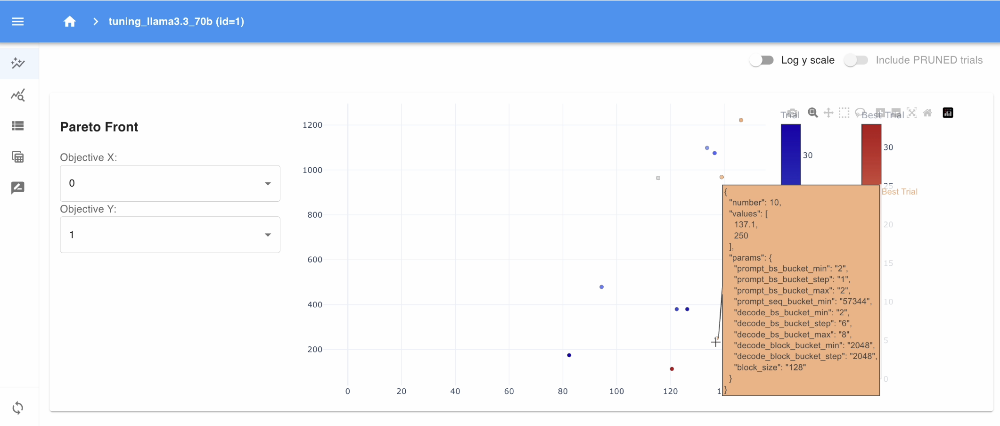

# Bucket Tuning with Benchmark Scripts on Gaudi

This README guides you through tuning bucket related configurations on Gaudi with online benchmark script and offline benchmark script by using [Optuna](https://github.com/optuna/optuna).

## Set Up

Install Optuna and optionally install Optuna dashboard:

```bash
pip install optuna
```
```bash
pip install optuna-dashboard
```

## Tuning with Offline Benchmark

The following command is an example of tuning configuration of VLLM_PROMPT_BS_BUCKET_MAX, decode batch size and block size with offline benchmark for Llama-3.1-8B on 1x HPU.

```bash
PT_HPU_ENABLE_LAZY_COLLECTIVES=true VLLM_EXPONENTIAL_BUCKETING=false PT_HPU_LAZY_MODE=1 PT_HPU_WEIGHT_SHARING=0 python tune_benchmark_offline.py \
--prompt-bs-bucket-max-range 2 4 2 --decode-bs-range 100 400 50 --input-len 1024 --output-len 1024 --num-trials 5 \
--benchmark-throughput-cmd "python benchmark_throughput.py --model meta-llama/Meta-Llama-3.1-8B-Instruct --dataset-name random --num-prompts 800 --tensor_parallel_size 1" \
--time-out 600 --task-name tune_llama3.1_8b_offline --tune-block-size
```
If successful, we would see the following output:

```bash
Number of finished trials:  5
The 0-th Pareto solution was found at Trial# 1
	 Params: {'block_size': 128, 'prompt_bs_bucket_max': 2, 'decode_bs': 300}, {'decode_block_step': 128, 'max_num_seqs': 300}
	 VLLM_PROMPT_BS_BUCKET_MIN=1
	 VLLM_PROMPT_BS_BUCKET_STEP=32
	 VLLM_PROMPT_BS_BUCKET_MAX=2
	 VLLM_PROMPT_SEQ_BUCKET_MIN=1024
	 VLLM_PROMPT_SEQ_BUCKET_STEP=128
	 VLLM_PROMPT_SEQ_BUCKET_MAX=2048
	 VLLM_DECODE_BS_BUCKET_MIN=300
	 VLLM_DECODE_BS_BUCKET_STEP=300
	 VLLM_DECODE_BS_BUCKET_MAX=300
	 VLLM_DECODE_BLOCK_BUCKET_MIN=2400
	 VLLM_DECODE_BLOCK_BUCKET_STEP=128
	 VLLM_DECODE_BLOCK_BUCKET_MAX=4928
	 --max-num-seqs 300
	 [Throughput(tokens/s), Warmup-Time(sec)]: [14319.96, 47.0]
The 1-th Pareto solution was found at Trial# 3
	 Params: {'block_size': 128, 'prompt_bs_bucket_max': 2, 'decode_bs': 300}, {'decode_block_step': 128, 'max_num_seqs': 300}
	 VLLM_PROMPT_BS_BUCKET_MIN=1
	 VLLM_PROMPT_BS_BUCKET_STEP=32
	 VLLM_PROMPT_BS_BUCKET_MAX=2
	 VLLM_PROMPT_SEQ_BUCKET_MIN=1024
	 VLLM_PROMPT_SEQ_BUCKET_STEP=128
	 VLLM_PROMPT_SEQ_BUCKET_MAX=2048
	 VLLM_DECODE_BS_BUCKET_MIN=300
	 VLLM_DECODE_BS_BUCKET_STEP=300
	 VLLM_DECODE_BS_BUCKET_MAX=300
	 VLLM_DECODE_BLOCK_BUCKET_MIN=2400
	 VLLM_DECODE_BLOCK_BUCKET_STEP=128
	 VLLM_DECODE_BLOCK_BUCKET_MAX=4928
	 --max-num-seqs 300
	 [Throughput(tokens/s), Warmup-Time(sec)]: [14324.62, 48.0]
The 2-th Pareto solution was found at Trial# 4
	 Params: {'block_size': 256, 'prompt_bs_bucket_max': 2, 'decode_bs': 350}, {'decode_block_step': 128, 'max_num_seqs': 350}
	 VLLM_PROMPT_BS_BUCKET_MIN=1
	 VLLM_PROMPT_BS_BUCKET_STEP=32
	 VLLM_PROMPT_BS_BUCKET_MAX=2
	 VLLM_PROMPT_SEQ_BUCKET_MIN=1024
	 VLLM_PROMPT_SEQ_BUCKET_STEP=256
	 VLLM_PROMPT_SEQ_BUCKET_MAX=2048
	 VLLM_DECODE_BS_BUCKET_MIN=350
	 VLLM_DECODE_BS_BUCKET_STEP=350
	 VLLM_DECODE_BS_BUCKET_MAX=350
	 VLLM_DECODE_BLOCK_BUCKET_MIN=1400
	 VLLM_DECODE_BLOCK_BUCKET_STEP=128
	 VLLM_DECODE_BLOCK_BUCKET_MAX=2928
	 --max-num-seqs 350
	 [Throughput(tokens/s), Warmup-Time(sec)]: [13112.79, 28.0]
```

## Tuning with Online Benchmark

The following command is an example to tune linear bucket configuration of VLLM_PROMPT_BS_BUCKET_MIN, VLLM_PROMPT_BS_BUCKET_STEP,
VLLM_PROMPT_BS_BUCKET_MAX, VLLM_PROMPT_SEQ_BUCKET_MIN, VLLM_DECODE_BS_BUCKET_MIN, VLLM_DECODE_BS_BUCKET_MAX,
VLLM_DECODE_BS_BUCKET_STEP, VLLM_DECODE_BLOCK_BUCKET_MIN, VLLM_DECODE_BLOCK_BUCKET_STEP, block size for Llama-3.3-70B-Instruct FP8
precision on 4x HPUs with the objective of best throughput and shorter warmup time.

```bash
QUANT_CONFIG=/root/software/quant/llama3.3-70b/maxabs_quant_g3.json RUNTIME_SCALE_PATCHING=1 PT_HPU_ENABLE_LAZY_COLLECTIVES=true \
VLLM_PROMPT_USE_FUSEDSDPA=1 VLLM_ALLOW_LONG_MAX_MODEL_LEN=1 PT_HPUGRAPH_DISABLE_TENSOR_CACHE=1 \
VLLM_EXPONENTIAL_BUCKETING=false  PT_HPU_LAZY_MODE=1 PT_HPU_WEIGHT_SHARING=0 VLLM_PROMPT_SEQ_BUCKET_MAX=132096 \
VLLM_PROMPT_SEQ_BUCKET_STEP=2048 python tune_benchmark_online.py --prompt-bs-bucket-min-range 1 2 1 \
--prompt-bs-bucket-step-range 1 2 1 --prompt-bs-bucket-max-range 1 4 1 --prompt-seq-bucket-min-range 49152 98304 2048  \
--decode-bs-bucket-min-range 1 2 1 --decode-bs-bucket-max-range 4 10 2 --decode-bs-bucket-step-range 2 8 2 \
--decode-block-bucket-step-range 1024 2048 1024 --decode-block-bucket-min-range 1024 2048 1024 --tune-block-size \
--vllm-server-cmd "python3 -m vllm.entrypoints.openai.api_server --port 9990 --model meta-llama/Llama-3.3-70B-Instruct --tensor-parallel-size 4 --max-num-seqs 1 --max-model-len 132096 --quantization inc --kv-cache-dtype fp8_inc --weights-load-device cpu" \
--benchmark-serving-cmd "python3 benchmark_serving.py --backend vllm --model meta-llama/Llama-3.3-70B-Instruct --dataset-name random --request-rate inf --num-prompts 5 --max-concurrency 21 --port 9990 --random-input-len 122880 --random-output-len 8192 --percentile-metrics ttft,tpot,itl,e2el --metric-percentiles 90 --ignore-eos" \
--task-name tuning_llama3.3_70b --time-out 1500
```

Tuning results are stored in sqlite database at /tmp/tuning_llama3.3_70b.db. You can check the tuning results with Optuna dashboard by running command:

```bash
optuna-dashboard sqlite:////tmp/tuning_llama3.3_70b.db
```

Optuna dashboard will be hosted at http://127.0.0.1:8080/ by default. You can check the details of tuning process, tuning configurations and results with dashboard:


